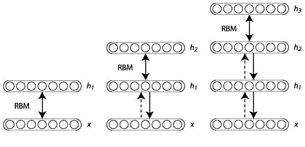

```{r setup, echo=F,include=F}
knitr::opts_chunk$set(comment = NA, highlight=T, cache=TRUE)
library(Rcpp)
setwd('/Users/si/Dropbox/Data-Science/Round2_si/Slides')
```


## Outline
- Recap: Deep Learning, RBM and Unsupervised pre-training
- Another method: Convolutional Neural Network (CNN)
- Some simulation results
- Extensions of Deep Learning: SVM with deep neural network
- Extensions of Deep Learning: Recommender System


## Recap: Deep Learning


Figure 1: Deep Neural Network with RBM as the building block.


## Recap: Deep Learning
Train a Deep Neural Network

- Pre-train with RBM: layer-wise training
- Train RBM: One-step Markov Chain
- Fine tuning: backpropagation


## Convolutional Neural Network (CNN)
Some basics

- Before 2006, only one kind of Deep Neural Network can be trained with good performance, which is **CNN**.
- Inspired by human visual field.
- Exploits **spatially-local correlation**.
- A CNN contains three types of layers:
    + Convolutional layer
    + Pooling layer
    + Fully-connected layer


## CNN: Sparse connection and Shared weights
\centerline{\includegraphics[height=12in]{weight.jpeg}}

Figure : (**Left**) The receptive field is 3. (**Right**) Weights of the same color are shared, they are constrained to be identical.

- **Gradient Descent** can still be used, with minor changes.
- The constraints make the learning algorithm more **efficient**.


## CNN: 4-dimensional weight tensor


Figure : The figure shows two layers of a CNN. Layer m-1 contains four feature maps. Hidden layer m contains two feature maps.


## CNN: example


Figure : The output of the previous two-layer CNN, it acts as a **filter** which detects the **edge**.


## CNN: Pooling and Fully-connected layers

Pooling layer

- The goal of this layer is to **reduce the dimension**.
- The pooling layer takes small **rectangular blocks** w/o overlapping.
- The layer **subsamples** from each block to produce a single output.
    + Maximum
    + Average
    + Linear combination
    + ...


Finally, after several convolutional and max pooling layers, the neural network ends with **fully connected** layers.


## Simulation: Effects of depth and pre-training


Figure 2: Effect of depth on performance for a model trained (**left**) without unsupervised pre-training and (**right**) with unsupervised pre-training


## Simulation: Effect of pre-training


Figure 3: The average squared reconstruction error.

**Left panel**: The deep 784-400-200-100-50-25-6 autoencoder. **Right panel**: A shallow 784-532-6 autoencoder.


## Simulation: Effect of layer size


Figure 4: Pre-training hurts for **smaller layer sizes** and **shallower** networks, but it helps for all depths for **larger** networks.


## Simulation: PCA visualization on `MINST` data


## Simulation: Classification of `MINST` data by a 784-1000-500-250-2 autoencoder


## Extension: SVM with Deep Neural Network


## Extension: Recommender System using RBM


## Extension: Recommender System using RBM

